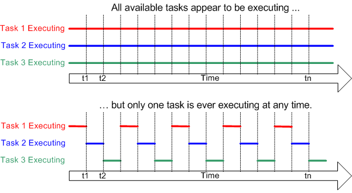

# Zephyr: Tutorial for Beginners

- [Zephyr: Tutorial for Beginners](#zephyr-tutorial-for-beginners)
  - [1. Introduction](#1-introduction)
    - [1.1. Useful links](#11-useful-links)
  - [2. Setup](#2-setup)
    - [2.1. VSCode + PlatformIO + Zephyr RTOS](#21-vscode--platformio--zephyr-rtos)
    - [2.2. VSCode + West + Zephyr RTOS](#22-vscode--west--zephyr-rtos)
    - [2.3. Eclipse + Plugin + Zephyr RTOS](#23-eclipse--plugin--zephyr-rtos)
  - [3. The Basics](#3-the-basics)
    - [3.1. RTOS basics](#31-rtos-basics)
    - [3.2. Zephyr-specific basics](#32-zephyr-specific-basics)
    - [3.3. gdb](#33-gdb)
    - [3.4. CMake](#34-cmake)
  - [4. Advanced](#4-advanced)
  - [5. Examples](#5-examples)
  - [6. Tests](#6-tests)
  - [6. Debugging](#6-debugging)
    - [6.1. West](#61-west)
    - [6.2. PlatformIO](#62-platformio)
  - [7. Projects using Zephyr RTOS](#7-projects-using-zephyr-rtos)

## 1. Introduction
Since Zephyr is a pretty young project I have found it a bit lacking in terms of tutorials for beginners (like myself). Therefore I decided to start writing this; to have 1 place that gives beginners a simple place to get started.

In terms of hardware you have a couple of different options:
- [Reel board](https://developer.nordicsemi.com/nRF_Connect_SDK/doc/0.3.0/zephyr/boards/arm/reel_board/doc/reel_board.html): This is a dev board from Nordic Semiconductor. Most examples are based on this board, so if you want the least "trouble", I'd go with this one. Downside: a bit expensive (~50eu).
- Nucleo: If you're already been working with embedded dev boards, chances are you have some of these laying around. I'm using a [Nucleo F756ZG](https://www.st.com/en/evaluation-tools/nucleo-f756zg.html).
- QEMU: If you don't have any boards, you can always use QEMU that allows you to emulate different platforms.

[Supported boards](https://docs.zephyrproject.org/latest/boards/index.html#boards)

### 1.1. Useful links
- [Zephyr Official Documentation](https://docs.zephyrproject.org/latest/)
- [Introduction to the Zephyr RTOS (video)](https://www.youtube.com/watch?v=jR5E5Kz9A-k): watch from 14:30-51:00
- [PlatformIO: Zephyr RTOS documentation](https://docs.platformio.org/en/latest/frameworks/zephyr.html)
  
## 2. Setup
### 2.1. VSCode + PlatformIO + Zephyr RTOS

Starting off I used this setup, if you don't need to go in-depth this will probably work. 

However once you start messing with more 'advanced' features of Zephyr, you will probably have to make the transition to the `west` metatool.

Setup:
1) Install VSCode
2) Add PlatformIO extension (will install Zephyr for you)
  
### 2.2. VSCode + West + Zephyr RTOS

The 'recommended' way to use Zephyr. 

Setup: [link](https://docs.zephyrproject.org/latest/getting_started/index.html)

### 2.3. Eclipse + Plugin + Zephyr RTOS
Relevant [section](https://docs.zephyrproject.org/latest/application/index.html?highlight=eclipse#debug-with-eclipse) in Zephyr Documentation.

- Zephyr-plugin doesn't work with the latest Eclipse. ([github-issue](https://github.com/zephyrproject-rtos/eclipse-plugin/issues/45))
- However if you use an older version it should work apparently. (haven't tested this myself)

Setup: [link](https://docs.zephyrproject.org/latest/application/index.html?highlight=eclipse#debug-with-eclipse)

## 3. The Basics

### 3.1. RTOS basics

Before going any further it might be useful to quickly go over some basic RTOS concepts.

First: what is an RTOS? It is an operating system that is intended to serve real-time applications. Typical time requirement are below 0.01s. Two types of systems can be identified:
- Event-driven: switch tasks based on their priorities
- Time-sharing: switch the task based on clock interrupts

Some key concepts:
- Kernel: the core component within an operating system. Takes care of scheduling the tasks in such a way that they *appear* to be happening simultanously.

- Task: Each executing program is a task (or thread) under control of the operating system.
- Scheduler: part of the kernel responsible for deciding which task should be executing at any particular time. The scheduling policy decides which task to execute at any point in time.
- Sleep: a task can choose to (voluntarily) suspend itself for a fixed period.
- Block: a task can wait for a resource to become available (eg a serial port) or an event to occur (eg a key press).
- Context: as a task executes it uses the registers and memory. The processor registers, stack, etc compromise the task execution context. On switching to a task the RTOS is responsible to set the context back to the way it was at the moment it got pre-empted the previous time. The process of saving the context of a task being suspended and restoring the context of a task being resumed is called context switching.

source: [wikipedia](https://en.wikipedia.org/wiki/Real-time_operating_system), [freertos](https://www.freertos.org/implementation/a00004.html)

### 3.2. Zephyr-specific basics

A Zephyr application directory has the following components:
- **CMakeLists.txt**: your build settings configuration file - this tells west (really a cmake build system under the hood) where to find what it needs to create your firmware. For more advanced projects, it's also used for debug settings, emulation, and other features.
- **prj.conf**: the Kernel configuration file. For most projects, it tells Zephyr whether to include specific features for use in your application code - if you use GPIO, PWM, or a serial monitor, you’ll need to enable them in this file first. Sometimes also referred to as Kconfig file. There is also something of a [GUI](https://docs.zephyrproject.org/2.4.0/guides/kconfig/menuconfig.html) which is helpful if you don't know where to start.
- **src/main.c**: your custom application code - where the magic happens! It’s advisable to put all of your custom source code in a `src/` directory like this so it doesn’t get mixed up with your configuration files.

### 3.3. gdb

At some point you will need to understand how gdb works.

[Video Tutorial](https://www.youtube.com/watch?v=FnfuxDVFcWE)

### 3.4. CMake

At some point it is recommended to understand how CMake works.

[Video Tutorial](https://www.youtube.com/watch?v=nlKcXPUJGwA&list=PLalVdRk2RC6o5GHu618ARWh0VO0bFlif4)

[Wiki CMake Tutorial](https://cmake.org/cmake/help/latest/guide/tutorial/index.html)

## 4. Advanced

For discussing more 'advanced' topics I have created a seperate [repository](https://github.com/maksimdrachov/zephyr-rtos-advanced-tutorial).

## 5. Examples
Location: `~/zephyrproject/zephyr/samples`

Basic examples useful to study for beginners are discussed here:

Advice: start with west immediately, if you find yourself overwhelmed, go to PlatformIO. Learn there, then go back to west.

- PlatformIO: [examples_PIO.md](https://github.com/maksimdrachov/zephyr-rtos-tutorial/blob/main/examples_PIO.md)
- west: [examples_west.md](https://github.com/maksimdrachov/zephyr-rtos-tutorial/blob/main/examples_west.md)

More advanced examples are discussed in [examples_adv.md](https://github.com/maksimdrachov/zephyr-rtos-tutorial/blob/main/examples_adv.md)

## 6. Tests
Location : `~/zephyrproject/zephyr/tests`

## 6. Debugging
### 6.1. West
[This](https://youtu.be/jR5E5Kz9A-k?t=2221) video shows a basic example of how you can use gdb to debug a reel-board.

For more advanced discussion of gdb, see [here](https://www.youtube.com/watch?v=FnfuxDVFcWE).

See [examples_west.md](https://github.com/maksimdrachov/zephyr-rtos-tutorial/blob/main/examples_west.md)

### 6.2. PlatformIO

## 7. Projects using Zephyr RTOS
- [Air-quality sensor](https://github.com/ExploratoryEngineering/air-quality-sensor-node)
- [Pinetime-hypnos](https://github.com/endian-albin/pinetime-hypnos) (smartwatch)
- [RT-Loc](https://github.com/RT-LOC/zephyr-dwm1001) (Ultra Wideband localisation using DWM1001 module)
- [BLE Environmental Sensor](https://github.com/patrickmoffitt/zephyr_ble_sensor)
- [STM32 Artnet-node](https://github.com/maksimdrachov/stm32-artnet) (This is the project I'm currently working on. For clarity, I'm documenting what each line does, so I can gain a better understanding:)