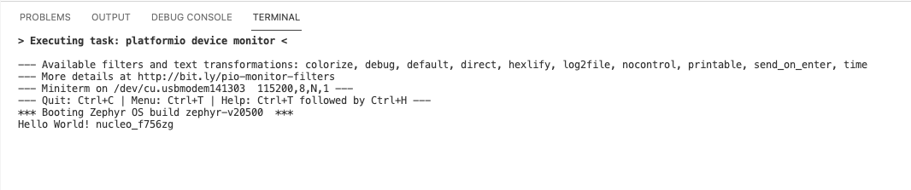
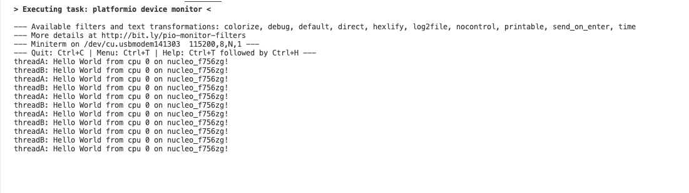
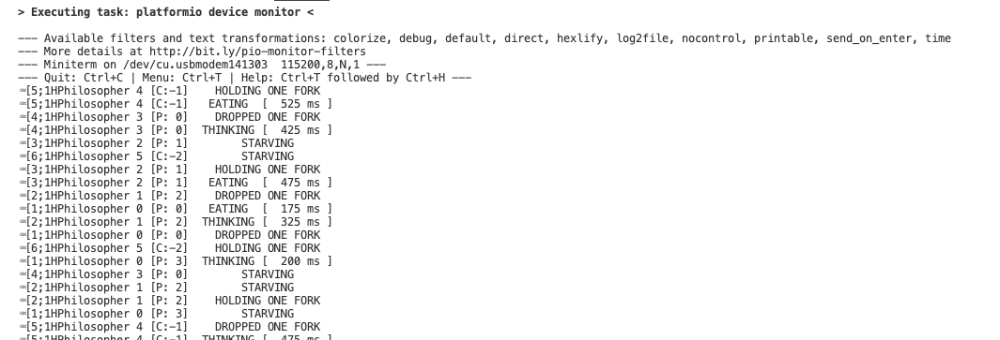
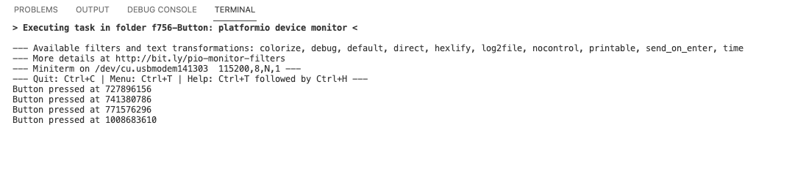
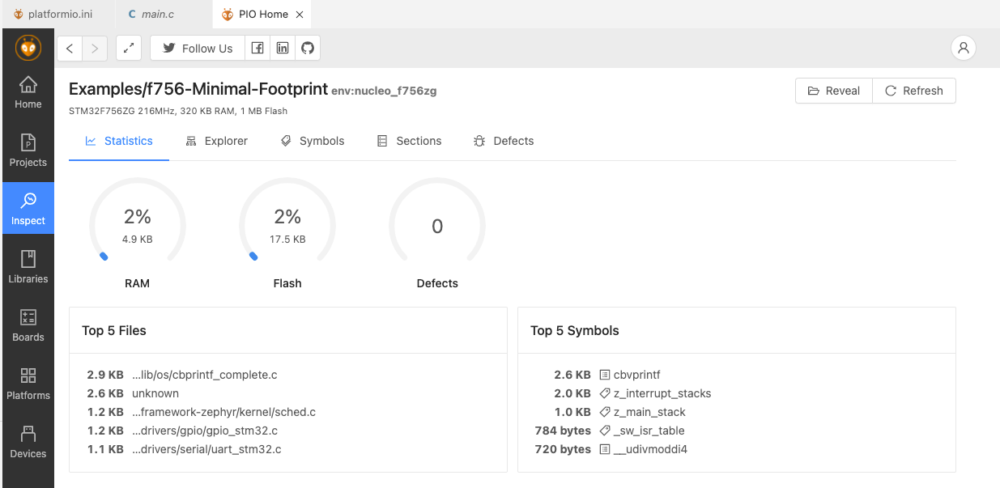
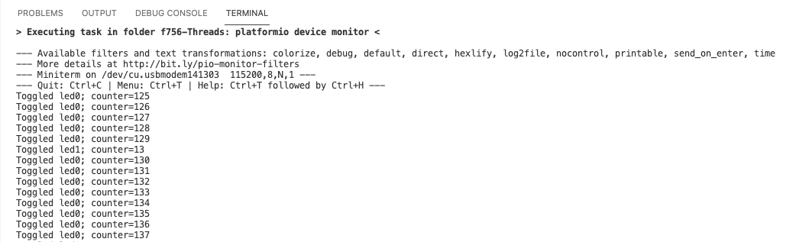
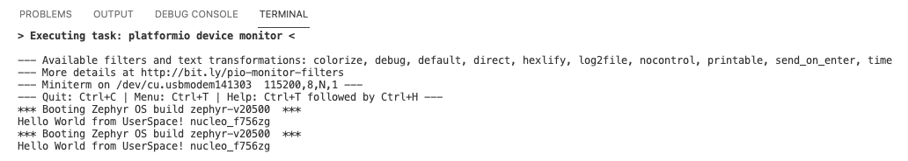
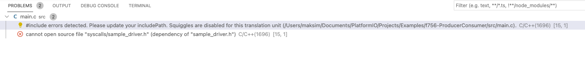
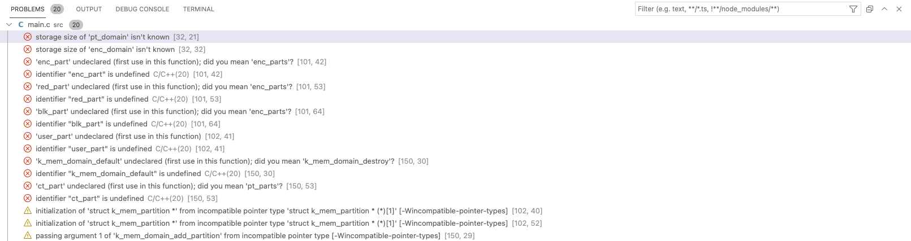
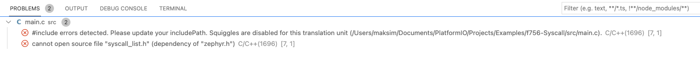

# Zephyr: Tutorial for Beginners

- [Zephyr: Tutorial for Beginners](#zephyr-tutorial-for-beginners)
  - [1. Introduction](#1-introduction)
    - [1.1. Useful links](#11-useful-links)
  - [2. Setup](#2-setup)
    - [2.1. VSCode + PlatformIO + Zephyr RTOS](#21-vscode--platformio--zephyr-rtos)
    - [2.2. Eclipse + Zephyr RTOS](#22-eclipse--zephyr-rtos)
    - [2.3. West + Zephyr RTOS](#23-west--zephyr-rtos)
  - [3. The Basics](#3-the-basics)
    - [3.1. RTOS basics](#31-rtos-basics)
    - [3.2. Zephyr-specific basics](#32-zephyr-specific-basics)
    - [3.3. CMake](#33-cmake)
  - [4. Examples](#4-examples)
    - [4.1. Classic Samples](#41-classic-samples)
      - [4.1.1. Hello World](#411-hello-world)
      - [4.1.2. Synchronization Sample](#412-synchronization-sample)
      - [4.1.3. Dining Philosophers](#413-dining-philosophers)
    - [4.2. Basic Samples](#42-basic-samples)
      - [4.2.1. Blinky](#421-blinky)
      - [4.2.2. PWM Blinky](#422-pwm-blinky)
      - [4.2.3. Button](#423-button)
      - [4.2.4. Fade LED](#424-fade-led)
      - [4.2.5. Minimal footprint](#425-minimal-footprint)
      - [4.2.6. PWM: RGB LED](#426-pwm-rgb-led)
      - [4.2.7. Servomotor](#427-servomotor)
      - [4.2.8. Basic Thread Example](#428-basic-thread-example)
    - [4.3. Userspace Samples](#43-userspace-samples)
      - [4.3.1. Hello World](#431-hello-world)
      - [4.3.2. Producer/consumer](#432-producerconsumer)
      - [4.3.3. Userspace Protected Memory](#433-userspace-protected-memory)
      - [4.3.4. Syscall performances](#434-syscall-performances)
  - [5. Debugging](#5-debugging)
  - [6. Projects using Zephyr RTOS](#6-projects-using-zephyr-rtos)

## 1. Introduction
Since Zephyr is a pretty young project I have found it a bit lacking in terms of tutorials for beginners (like myself). Therefore I decided to start writing this; to have 1 place that gives beginners a simple place to get started.

### 1.1. Useful links
- [Zephyr Official Documentation](https://docs.zephyrproject.org/latest/)
- [Introduction to the Zephyr RTOS (video)](https://www.youtube.com/watch?v=jR5E5Kz9A-k): watch from 14:30-51:00
- [PlatformIO: Zephyr RTOS documentation](https://docs.platformio.org/en/latest/frameworks/zephyr.html)
  
## 2. Setup
### 2.1. VSCode + PlatformIO + Zephyr RTOS
- NOOB-friendly!

This is the one that I'm currently using, the examples are based on this setup.

Setup:
1) Install VSCode
2) Add PlatformIO extension (will install Zephyr for you)
### 2.2. Eclipse + Zephyr RTOS
Relevant [section](https://docs.zephyrproject.org/latest/application/index.html?highlight=eclipse#debug-with-eclipse) in Zephyr Documentation.

- Zephyr-plugin doesn't work with the latest Eclipse. ([github-issue](https://github.com/zephyrproject-rtos/eclipse-plugin/issues/45))
- However if you use an older version it should work apparently. (haven't tested this myself)

Setup: [link](https://docs.zephyrproject.org/latest/application/index.html?highlight=eclipse#debug-with-eclipse)

### 2.3. West + Zephyr RTOS
- Real pro's use this.

Setup: [link](https://docs.zephyrproject.org/latest/getting_started/index.html)

## 3. The Basics

### 3.1. RTOS basics
This [section](https://www.freertos.org/implementation/a00002.html) from FreeRTOS should cover the basics of what an RTOS does.

### 3.2. Zephyr-specific basics

A Zephyr application directory has the following components:
- **CMakeLists.txt**: your build settings configuration file - this tells west (really a cmake build system under the hood) where to find what it needs to create your firmware. For more advanced projects, it's also used for debug settings, emulation, and other features.
- **prj.conf**: the Kernel configuration file. For most projects, it tells Zephyr whether to include specific features for use in your application code - if you use GPIO, PWM, or a serial monitor, you’ll need to enable them in this file first. Sometimes also referred to as Kconfig file. There is also something of a [GUI](https://docs.zephyrproject.org/2.4.0/guides/kconfig/menuconfig.html) which is helpful if you don't know where to start.
- **src/main.c**: your custom application code - where the magic happens! It’s advisable to put all of your custom source code in a `src/` directory like this so it doesn’t get mixed up with your configuration files.

Explanation on devicetree needed.

### 3.3. CMake

At some point you will need to understand how CMake works.

[Video Tutorial](https://www.youtube.com/watch?v=nlKcXPUJGwA&list=PLalVdRk2RC6o5GHu618ARWh0VO0bFlif4) <- This one offers a pretty clear explanation for beginners

[Wiki CMake Tutorial](https://cmake.org/cmake/help/latest/guide/tutorial/index.html)

## 4. Examples
Location: `~/zephyrproject/zephyr/samples`

Basic examples useful to study for beginners are discussed here.

More advanced examples are discussed in [`examples.md`](https://github.com/maksimdrachov/zephyr-rtos-tutorial/blob/main/examples.md)

I'm using the samples from Zephyr 2.5.0, since that is the latest version of Zephyr that is available on PlatformIO.

To get Zephyr 2.5.0:
```
git clone https://github.com/zephyrproject-rtos/zephyr
git checkout v2.5-branch
```
To check version of Zephyr (for PlatformIO) -> make sure the samples you use are from the same version!
```
cd ~/.platformio/packages/framework-zephyr
mate VERSION
```

### 4.1. Classic Samples

#### 4.1.1. Hello World
Simple example, useful to understand the setup process.
1) Create new project in PlatformIO<br/>
   -> select your platform and Zephyr RTOS
2) Add `prj.conf` to `zephyr` subfolder (even though empty for this example)
3) Add `monitor_speed = 115200` to `platformio.ini` (if you get weird characters in the serial window, probably wrong baud-rate setting here)
4) Copy code to `main.c`
5) 'Build'
6) 'Flash'
7) Open Serial to verify
  
Example output (press reset on your board to see output)


> TIP: Sometimes you want to check the Kconfig setup for your specific build. 
> See `<project>/.pio/build/<board>/zephyr/.config` for the final settings.
> ```
> cd .pio/build/nucleo_f756zg/zephyr
> mate .config
> ```


#### 4.1.2. Synchronization Sample
Same setup as previous example

Code has lots of comments so is pretty clear.

Example output:


#### 4.1.3. Dining Philosophers
Same setup as previous example. 

There is a header file (`phil_obj_abstract.h`), which should go into the `include` subfolder (instead of `src`).

Example output:



### 4.2. Basic Samples

#### 4.2.1. Blinky
Same setup as previous example

Lessons:
- First example that requires to set a Kconfig (see `prj.conf`)
```
CONFIG_GPIO=y
```
- Shows how to set up and use a GPIO pin

Example output: LED should blink at 1 Hz

#### 4.2.2. PWM Blinky
#### 4.2.3. Button
Lessons:
- Shows how to set up an input GPIO pin
- Shows how to set up an interrupt function

Example output:

#### 4.2.4. Fade LED
#### 4.2.5. Minimal footprint
1) Copy settings from example Kconfig files to `zephyr/prj.conf`
2) Inspect code using PlatformIO

Lessons:
- Shows how to check footprint

_common.conf_
```
# Drivers and peripherals
CONFIG_I2C=n
CONFIG_WATCHDOG=n
CONFIG_GPIO=n
CONFIG_PINMUX=n
CONFIG_SPI=n
CONFIG_SERIAL=n
CONFIG_FLASH=n

# Power management
CONFIG_PM=n

# Interrupts
CONFIG_DYNAMIC_INTERRUPTS=n
CONFIG_IRQ_OFFLOAD=n

# Memory protection
CONFIG_THREAD_STACK_INFO=n
CONFIG_THREAD_CUSTOM_DATA=n
CONFIG_FPU=n

# Boot
CONFIG_BOOT_BANNER=n
CONFIG_BOOT_DELAY=0

# Console
CONFIG_CONSOLE=n
CONFIG_UART_CONSOLE=n
CONFIG_STDOUT_CONSOLE=n
CONFIG_PRINTK=n
CONFIG_EARLY_CONSOLE=n

# Build
CONFIG_SIZE_OPTIMIZATIONS=y
```

_no-mt.conf_
```
# Single-threaded, no timer support in the kernel
CONFIG_MULTITHREADING=n
CONFIG_KERNEL_MEM_POOL=n
```

_no-timers.conf_
```
# No timer support in the kernel
CONFIG_SYS_CLOCK_EXISTS=n
```

Example output:
_common.conf_


Example output:
_no-mt.conf_ and _no-timers.conf_


#### 4.2.6. PWM: RGB LED
#### 4.2.7. Servomotor
#### 4.2.8. Basic Thread Example
Lessons:
- First example that shows how to use threads, study this one carefully.

Example output:


### 4.3. Userspace Samples

#### 4.3.1. Hello World
Lessons:
- Simple example of how to create a thread with a defined stacksize.

Example output:


#### 4.3.2. Producer/consumer
```diff
- ERROR BUILDING
```
I suspect my error has something to do with my CMakeLists.txt, since all the problems are caused by missing 'dependencies'.

Since all the next errors have the same fundamental reason, hopefully if someone can help me fix one of them I should be able to resolve the rest. :)
```
cannot open source file "syscalls/sample_driver.h" (dependency of "sample_driver.h")
```


#### 4.3.3. Userspace Protected Memory
```diff
- ERROR BUILDING
```
```
storage size of 'pt_domain' isn't known
storage size of 'enc_domain' isn't known
'enc_part' undeclared (first use in this function); did you mean 'enc_parts'?
identifier "enc_part" is undefined
```


#### 4.3.4. Syscall performances
```diff
- ERROR BUILDING
```
```
cannot open source file "syscall_list.h" (dependency of "zephyr.h")
```


## 5. Debugging
```diff
- Can someone explain the setup for debugging?
```
 Is it possible to get RTOS aware debugging inside PlatformIO?

## 6. Projects using Zephyr RTOS
- [Air-quality sensor](https://github.com/ExploratoryEngineering/air-quality-sensor-node)
- [Pinetime-hypnos](https://github.com/endian-albin/pinetime-hypnos) (smartwatch)
- [RT-Loc](https://github.com/RT-LOC/zephyr-dwm1001) (Ultra Wideband localisation using DWM1001 module)
- [BLE Environmental Sensor](https://github.com/patrickmoffitt/zephyr_ble_sensor)

This is the project I'm currently working on. For clarity, I'm documenting what each line does, so I can gain a better understanding:
- [STM32 Artnet-node](https://github.com/maksimdrachov/stm32-artnet)