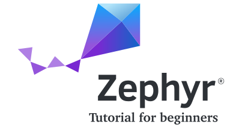

   <a href="https://www.zephyrproject.org">
     

       
     

   </a>

A step-by-step guide that teaches you how to use Zephyr RTOS. It assumes:
- knowledge of C
- no previous experience with RTOS
- basic embedded electronics knowledge (GPIO, Timers, Interrupt,...)

Each lesson builds on the previous one. Most lessons end with exercises (with solutions!) that show how the covered concepts can be used in a practical application.

This tutorial is under active development, if you want to participate - please read the [Contribution guide](docs/Contributions.md).

**A web version of this tutorial can be found [here](https://maksimdrachov.github.io/zephyr-rtos-tutorial)**

## Table of Contents

- [x] **[Introduction](docs/Introduction.md)**
- [x] **[Contribution guide](docs/Contributions.md)**
- [x] **[Prerequisites](docs/Prerequisites.md)**
- [ ] **Lesson 1: Zephyr Setup** 
  - [ ] 1.1 Installation
    - [x] [MacOS](docs/1-zephyr-setup/install/mac-os.md)
    - [ ] [Linux](docs/1-zephyr-setup/install/linux.md)
    - [ ] [Windows](docs/1-zephyr-setup/install/windows.md)
  - [ ] 1.2 Basic Workspace Setup
    - [x] [MacOS](docs/1-zephyr-setup/setup/mac-os.md)
    - [ ] [Linux](docs/1-zephyr-setup/setup/linux.md)
    - [ ] [Windows](docs/1-zephyr-setup/setup/windows.md)

- [x] **Lesson 2: Introduction**
  - [x] 2.1 [RTOS basics](docs/2-introduction/rtos-basics.md)
  - [x] 2.2 [Zephyr structure](docs/2-introduction/zephyr-structure.md)
  - [x] 2.3 [Tutorial structure](docs/2-introduction/tutorial-structure.md)
  
- [x] **Lesson 3: Threads**
  - [x] 3.1 [Introduction](docs/3-threads/introduction.md)
  - [x] 3.2 [Commands](docs/3-threads/commands.md)
  - [x] 3.3 [Kconfig](docs/3-threads/kconfig.md)
  - [x] 3.4 [Exercise](docs/3-threads/exercise.md)

- [x] **Lesson 4: GPIO**
  - [x] 4.1 [Introduction](docs/4-gpio/introduction.md)
  - [x] 4.2 [Commands](docs/4-gpio/commands.md)
  - [x] 4.3 [Kconfig](docs/4-gpio/kconfig.md)
  - [x] 4.4 [Exercise](docs/4-gpio/exercise.md)

- [x] **Lesson 5: Scheduling**
  - [x] 5.1 [Introduction](docs/5-scheduling/introduction.md)
  - [x] 5.2 [Commands](docs/5-scheduling/commands.md)
  - [x] 5.3 [Kconfig](docs/5-scheduling/kconfig.md)
  - [x] 5.4 [Exercise](docs/5-scheduling/exercise.md)

- [ ] **Lesson 6: Logging**
  - [x] 6.1 [Introduction](docs/6-logging/introduction.md)
  - [x] 6.2 [Commands](docs/6-logging/commands.md)
  - [x] 6.3 [Kconfig](docs/6-logging/kconfig.md)
  - [ ] 6.4 [Exercise](docs/6-logging/exercise.md)

- [ ] **Lesson 7: Debugging**
  - [x] 7.1 [Introduction](docs/7-debugging/introduction.md)
  - [x] 7.2 [Commands](docs/7-debugging/commands.md)
  - [x] 7.3 [Kconfig](docs/7-debugging/kconfig.md)
  - [x] 7.4 [Exercise](docs/7-debugging/exercise.md)

- [x] **Lesson 8: Interrupts** 
  - [x] 8.1 [Introduction](docs/8-interrupts/introduction.md)
  - [x] 8.2 [Commands](docs/8-interrupts/commands.md)
  - [x] 8.3 [Kconfig](docs/8-interrupts/kconfig.md)
  - [x] 8.4 [Exercise](docs/8-interrupts/exercise.md)

- [ ] **Lesson 9: Timers**
  - [x] 9.1 [Introduction](docs/9-timers/introduction.md)
  - [x] 9.2 [Commands](docs/9-timers/commands.md)
  - [x] 9.3 [Kconfig](docs/9-timers/kconfig.md)
  - [x] 9.4 [Exercise](docs/9-timers/exercise.md)

- [ ] **Lesson 10: Mutexes**
  - [x] 10.1 [Introduction](docs/10-mutexes/introduction.md)
  - [x] 10.2 [Commands](docs/10-mutexes/commands.md)
  - [x] 10.3 [Kconfig](docs/10-mutexes/kconfig.md)
  - [ ] 10.4 [Exercise](docs/10-mutexes/exercise.md)

## Useful Links
**General**
- [Zephyr Official Documentation](https://docs.zephyrproject.org/latest/)
- [Introduction to the Zephyr RTOS (video)](https://www.youtube.com/watch?v=jR5E5Kz9A-k)
- [awesome-zephyr](https://github.com/fkromer/awesome-zephyr)

**Youtube channels**
- [The Linux Foundation](https://www.youtube.com/c/LinuxfoundationOrg/search?query=zephyr)
- [Zephyr Project](https://www.youtube.com/c/ZephyrProject/videos)

**Projects using Zephyr**
- [Golioth: IoT cloud platform](https://github.com/golioth/zephyr-sdk)
- [Battery management system](https://github.com/scttnlsn/bms)
- [MG100: IoT sensor module](https://github.com/LairdCP/MG100_firmware)
- [Anyl: Embedded crypto wallet (for IoT)](https://github.com/Anylsite/anyl-wallet)
- [BLE sensor](https://github.com/patrickmoffitt/zephyr_ble_sensor)
- [PineTime smartwatch](https://github.com/endian-albin/pinetime-hypnos)
- [UWB position tracking](https://github.com/RT-LOC/zephyr-dwm1001)
- [zmk: mechanical keyboard firmware](https://github.com/zmkfirmware/zmk)
- [air quality sensor](https://github.com/ExploratoryEngineering/air-quality-sensor-node)

**Zephyr libraries**
- [Zephyr Scientific Library](https://github.com/zscilib/zscilib)
- [micro-ROS Zephyr module](https://github.com/micro-ROS/micro_ros_zephyr_module)
- [sof: sound/DSP firmware](https://github.com/thesofproject/sof)

## Contact
Follow me on [twitter](https://twitter.com/maksimdrachov): stay up to date on my latest blogs/projects