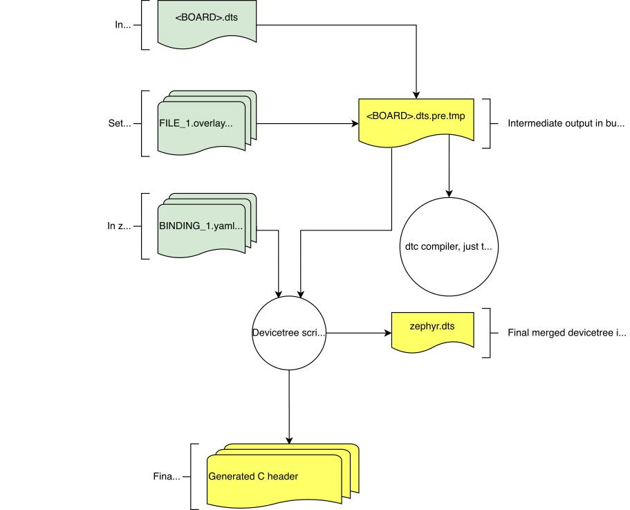

# Devicetree guide

## 1. Introduction

The build system uses devicetree sources and bindings to produce a generated C header. The generated header's contents are abstracted by the `devicetree.h` api (see zephyr/include/devicetree.h). 


## 2. Input and output files



There are four types of input and output files:
- sources (.dts)
- includes (.dtsi)
- overlays (.overlay)
- bindings (.yaml)

The devicetree files inside the zephyr directory looks like this:
```
boards/<ARCH>/<BOARD/<BOARD>.dts
dts/common/skeleton.dtsi
dts/<ARCH>/.../<SOC>.dtsi
dts/bindings/.../binding.yaml
```


