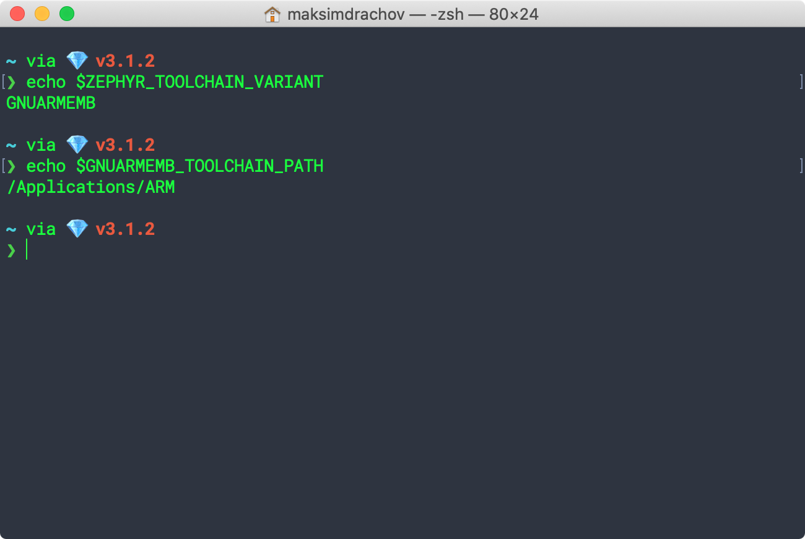
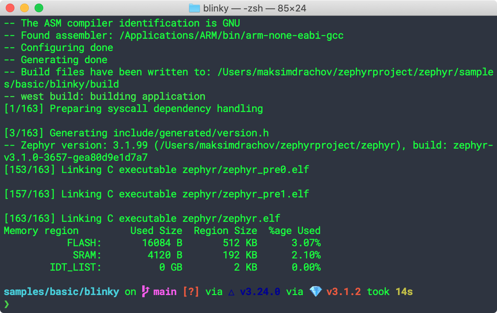

# Install

## 1) Install dependencies

- Install Homebrew
  
```
/bin/bash -c "$(curl -fsSL https://raw.githubusercontent.com/Homebrew/install/HEAD/install.sh)"
```

- Use `brew` to install the required dependencies
  
```
brew install cmake ninja gperf python3 ccache qemu dtc textmate    
```

## 2) Clone Zephyr
```
cd ~
mkdir zephyrproject
cd zephyrproject
git clone https://github.com/zephyrproject-rtos/zephyr
```

## 3) Install `west`
- Install `west`

```
pip3 install -U west
```

- Add `west` to path

```
mate etc/paths
#Add /Users/<username>/Library/Python/<version>/bin
```

(running `pip3 show -f west` shows where the binary is installed)

- Get the Zephyr source code
  
```
west init ~/zephyrproject
cd ~/zephyrproject
west update
```

- Export Zephyr CMake package: 
  
```
west zephyr-export
```

(this allows CMake to automatically load boilerplate required for building Zephyr applications)

- Install additional dependencies using `pip3`

```
pip3 install -r ~/zephyrproject/zephyr/scripts/requirements.txt
```

## 4) Install GNU ARM Embedded toolchain

- Download and install [GNU ARM Embedded build](https://developer.arm.com/tools-and-software/open-source-software/developer-tools/gnu-toolchain/gnu-rm/downloads) (`.pkg`)
  
- Set environment variables in `~/.zshenv`
  
```
mate .zshenv
```

Add the following lines:

```
export ZEPHYR_TOOLCHAIN_VARIANT=GNUARMEMB
export GNUARMEMB_TOOLCHAIN_PATH=/Applications/ARM
```

- Restart terminal and check if environment variables are set up correctly

```
echo $ZEPHYR_TOOLCHAIN_VARIANT
echo $GNUARMEMB_TOOLCHAIN_PATH
```
  


## 5) Build the Blinky sample

The board name can be found under `~/zephyrproject/zephyr/boards`

```
cd ~/zephyrproject/zephyr/samples/basic/blinky
west build -b <board-name>  # for example: nucleo_l552ze_q
```
A successful build looks like this:


> **NOTE**:  Sometimes you'll need to delete the build folder to start from scratch: `rm -rf build`

## 6) Flash the sample
```
cd ~/zephyrproject/zephyr/samples/basic/blinky
west flash
```
A succesful flash looks like this:


{: .warning}
Some boards will require installing an additional pyocd package! 

For Nucleo L552ZE-Q: `pyocd pack install stm32l552zetxq` (see [pyocd/target_support](https://pyocd.io/docs/target_support.html#managed-packs))