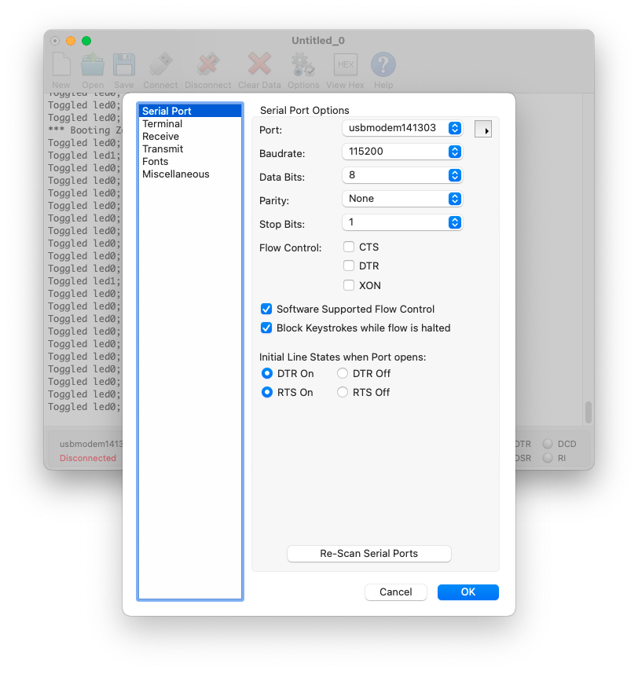
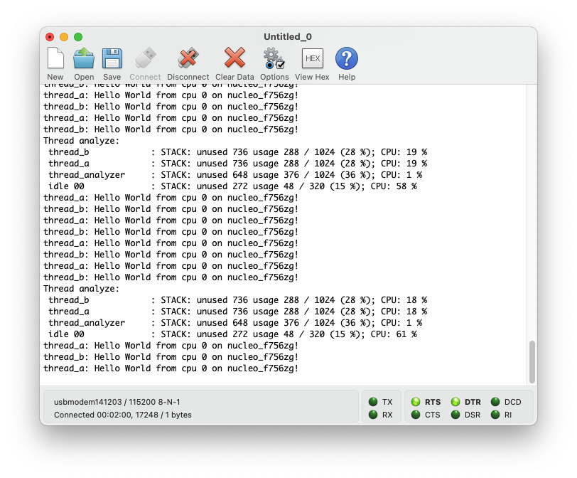
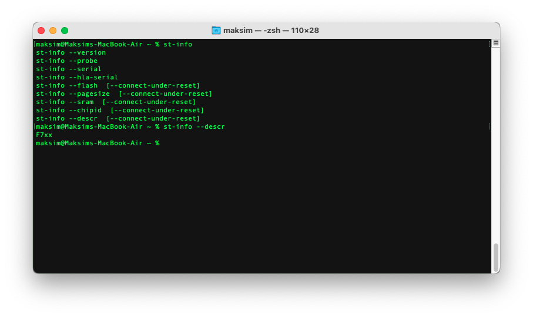
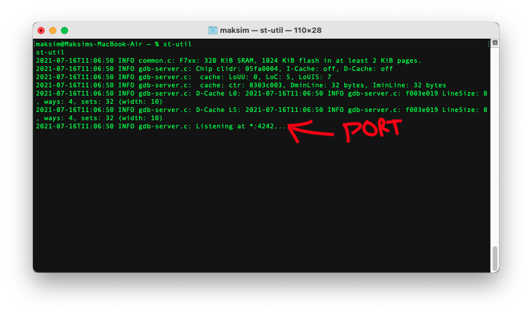
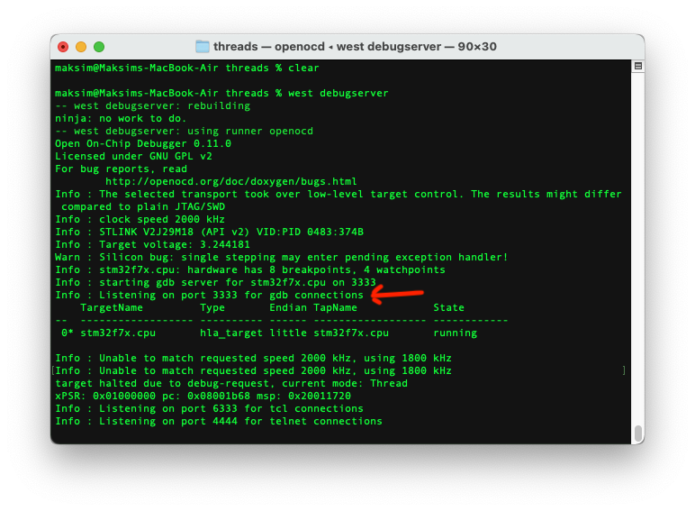
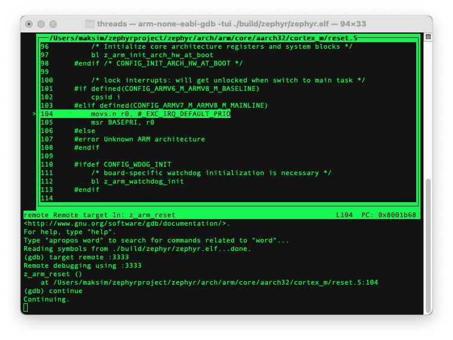

# 1. Setup

Follow [this](https://docs.zephyrproject.org/latest/getting_started/index.html)

Zephyr provides some explanation on how to setup and run the examples [here](https://docs.zephyrproject.org/latest/samples/index.html#samples-and-demos). These are my personal notes/additions to the official documentation.

- Open VSCode
- File -> Open... -> ~/zephyrproject
- Terminal -> New Terminal

## 1.1. Serial connection
You have different options here:
- Terminal (Mac)
  ```
  
  ```
- Terminal within VSCode
- CoolTerm (or some alternative)

  

# 2. Examples

## 2.1. Classic Samples
### 2.1.1. Hello World
```
cd zephyr/samples/hello_world
west build -b nucleo_f756zg
west flash
```
Check with serial interface if "hello world" is being output.


### 2.1.2. Synchronization Sample
```
cd zephyr/samples/synchronization
west build -b nucleo_f756zg
west flash
```
Check with serial interface if output correct.


### 2.1.3. Dining Philosophers
```
cd zephyr/samples/philosophers
west build -b nucleo_f756zg
west flash
```
Check with serial interface if output correct.


## 2.2. Basic Samples
### 2.2.1. Blinky
### 2.2.2. PWM Blinky
### 2.2.3. Button
### 2.2.4. Fade LED
### 2.2.5. Minimal footprint
### 2.2.6. PWM: RGB LED
### 2.2.7. Servomotor
### 2.2.8. Basic Thread Example
```
cd zephyr/samples/basic/threads
west build -b nucleo_f756zg
west flash
```
Check with serial interface if output correct.


## 2.3. Userspace Samples
### 2.3.1. Hello World
### 2.3.2. Producer/consumer
### 2.3.3. Userspace Protected Memory
### 2.3.4. Syscall performances

# 3. Debugging

[General overview of debugging techniques](https://www.youtube.com/watch?v=FnfuxDVFcWE)

[GDB tutorial](https://www.youtube.com/watch?v=svG6OPyKsrw)

## 3.1. Thread Analyzer

[Thread analyzer](https://docs.zephyrproject.org/latest/guides/debug_tools/thread-analyzer.html)

```
cd zephyr/samples/synchronization

west build -b nucleo_f756zg -- -DCONFIG_QEMU_ICOUNT=n -DCONFIG_THREAD_ANALYZER=y \
-DCONFIG_THREAD_ANALYZER_USE_PRINTK=y -DCONFIG_THREAD_ANALYZER_AUTO=y \
-DCONFIG_THREAD_ANALYZER_AUTO_INTERVAL=5

west flash
```



## 3.2. st-link
For STM32 platforms
- `st-info` - a programmer and chip information tool
- `st-flash` - a flash manipulation tool
- `st-trace` - a logging tool to record information on execution
- `st-util` - a GDB server (supported in VSCode via the [Cortex-Debug](https://github.com/Marus/cortex-debug) plugin)
- `stlink-lib` - a communication library

Additional information see [github-stlink](https://github.com/stlink-org/stlink)

```
st-link --descr

st-util
```



## 3.3. GDB

[GDB Official Documentation](http://sourceware.org/gdb/current/onlinedocs/gdb/index.html#SEC_Contents)

[Debugging Programs with Multiple Threads](http://sourceware.org/gdb/current/onlinedocs/gdb/Threads.html#Threads)

[GDB and OpenOCD](http://openocd.org/doc/html/GDB-and-OpenOCD.html)

## 3.4. GDB

[GDB stub Zephyr Documentation](https://docs.zephyrproject.org/latest/guides/debug_tools/gdbstub.html)

Check: samples/subsys/debug/gdbstub

```
cd zephyr/samples/basic/threads
west build -b nucleo_f756zg
west flash
west debugserver
```


```
arm-none-eabi-gdb -tui ./build/zephyr/zephyr.elf
(gdb) target remote :3333
(gdb) continue
```

- continue: program continues to run (you can check if lights are blinking correctly)
- ctrl-c: stop program

## 3.5. Tracing

[Download and Install TraceCompass](https://www.eclipse.org/tracecompass/)

[Common MacOSX issue: App is damaged and can't be opened](https://apple.stackexchange.com/questions/372084/macos-catalina-app-is-damaged-and-cant-be-opened-you-should-move-it-to-the-t)

[Tracing](https://docs.zephyrproject.org/latest/guides/debug_tools/tracing/index.html)

## 3.6. Core Dump

[Core Dump](https://docs.zephyrproject.org/latest/guides/debug_tools/coredump.html)


