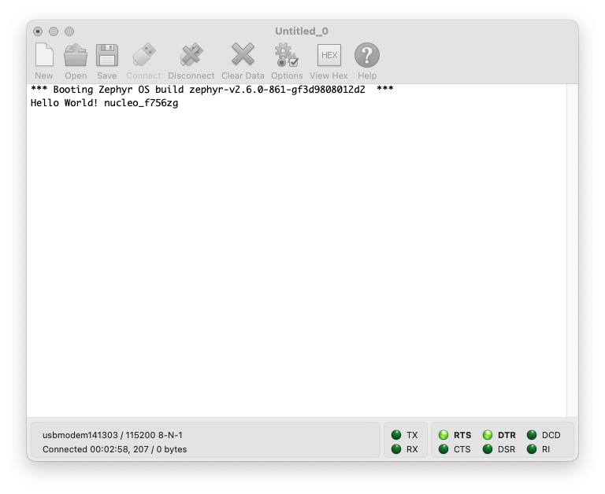
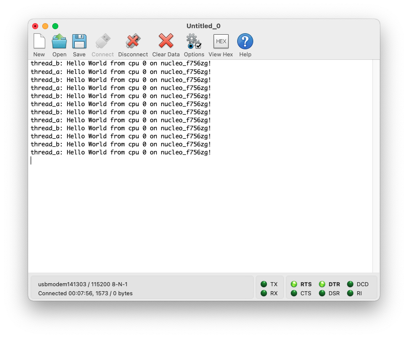
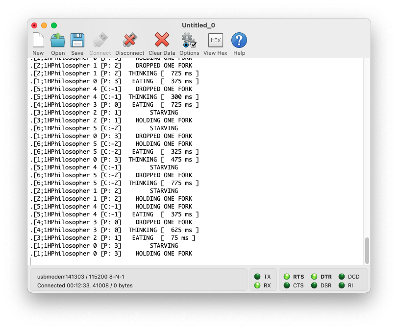
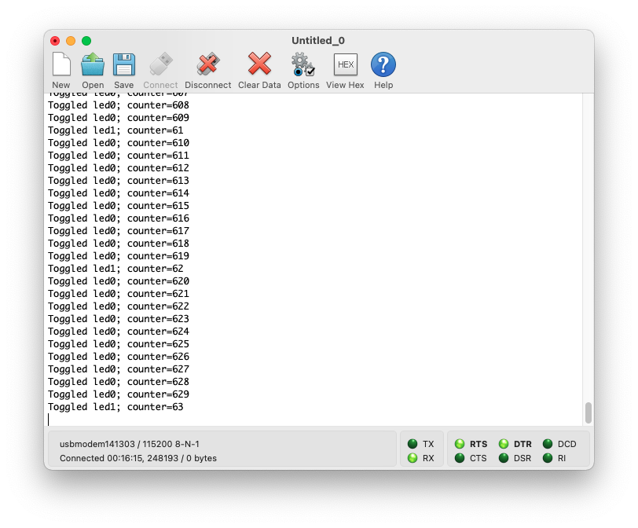

# 1. Setup

Follow [this](https://docs.zephyrproject.org/latest/getting_started/index.html)

Zephyr provides some explanation on how to setup and run the examples [here](https://docs.zephyrproject.org/latest/samples/index.html#samples-and-demos). These are my personal notes/additions to the official documentation.

- Open VSCode
- File -> Open... -> ~/zephyrproject
- Terminal -> New Terminal


# 2. Examples

## 2.1. Classic Samples
### 2.1.1. Hello World
```
cd zephyr/samples/hello_world
west build -b nucleo_f756zg
west flash
```
Check with serial interface if "hello world" is being output.



### 2.1.2. Synchronization Sample
```
cd zephyr/samples/synchronization
west build -b nucleo_f756zg
west flash
```
Check with serial interface if output correct.



### 2.1.3. Dining Philosophers
```
cd zephyr/samples/philosophers
west build -b nucleo_f756zg
west flash
```
Check with serial interface if output correct.



## 2.2. Basic Samples
### 2.2.1. Blinky
### 2.2.2. PWM Blinky
### 2.2.3. Button
### 2.2.4. Fade LED
### 2.2.5. Minimal footprint
### 2.2.6. PWM: RGB LED
### 2.2.7. Servomotor
### 2.2.8. Basic Thread Example
```
cd zephyr/samples/basic/threads
west build -b nucleo_f756zg
west flash
```
Check with serial interface if output correct.




## 2.3. Userspace Samples
### 2.3.1. Hello World
### 2.3.2. Producer/consumer
### 2.3.3. Userspace Protected Memory
### 2.3.4. Syscall performances

# 3. Debugging
