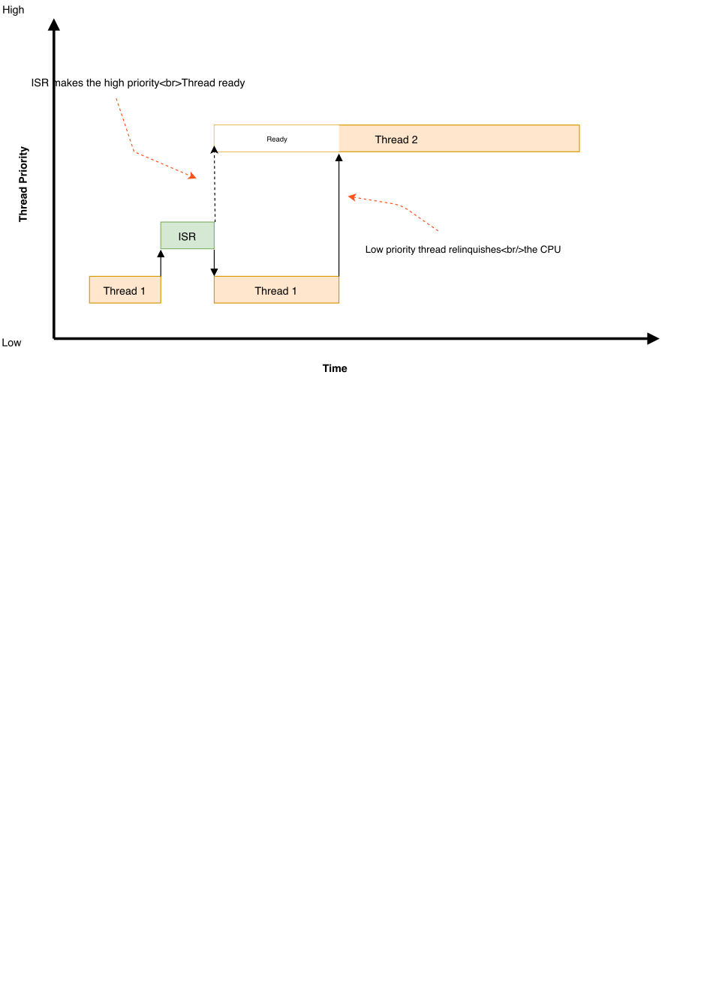
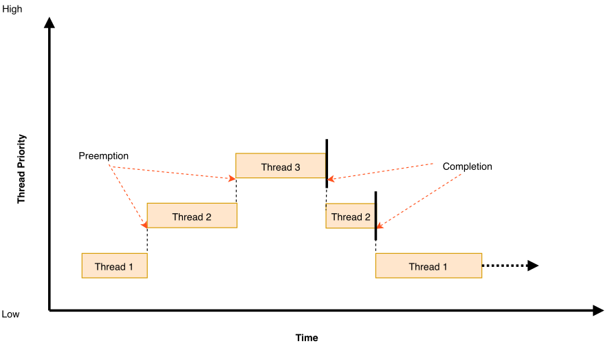

# Scheduling

## 1. Introduction
- **Current thread**: the thread that is currently executing.
- **Reschedule points**: when the scheduler is given an opportunity to change the identity of the current thread. Potential reschedule points:
  - transition of a thread from running state to a suspended state or waiting state, for example by k_sem_take() or k_sleep()
  - transition of a thread to the ready state, for example by k_sem_give() or k_thread_start()
  - return to thread context after processing an interrupt
  - when a running thread invokes k_yield()

## 2. Scheduling algorithm
The kernel's scheduler selects the next thread based on priority, if multiple threads have the same priority, the scheduler chooses the one that has been waiting the longest.

Execution of ISRs takes precedence over thread execution, unless interrupts are masked.

Several choices for the ready queue implementation, offering different choices between code size, constant factor runtime overhead and performance scaling when many threads are added. 
- Simple linked-list ready queue (CONFIG_SCHED_DUMB)
  
  The scheduler ready queue will be implemented as a simple unordered list, with very fast constant time performance for single threads and very low code size. This implementation should be selected on systems with constrained code size that will never see more than a small number (3, maybe) of runnable threads in the queue at any given time. On most platforms this results in a savings of ~2k of code size.

- Red/black tree ready queue (CONFIG_SCHED_SCALABLE)
  
  The scheduler ready queue will be implemented as a red/black tree. This has rather slower constant-time insertion and removal overhead, and on most platforms requires an additional ~2kb of code. The resulting behaviour will scale cleanly and quickly into many thousands of threads. Use this for applications needing many concurrent runnable threads (>20 or so). Most applications won't need this.

- Traditional multi-queue ready queue (CONFIG_SCHED_MULTIQ)
- 
  The scheduler will be implemented as the classic array of lists, one per priority (max 32 priorities). It incurs only a tine code size overhead vs the "dumb" scheduler and runs in O(1) time in almost all circumstances with very low constant factor. But it requires a fairly large RAM budget to store those list heads. Typical applications with small number of threads probably want the DUMB scheduler. 

## 3. Time slicing
### 3.1. Cooperative Time Slicing
Once a cooperative thread becomes the current thread, it remains the current thread
- until it performs an action that makes it unready
  
Consequently, if a cooperative thread performs lengthy computations, it may cause an unacceptable delay in the scheduling of other threads, including those of higher priority and equal priority.

To overcome such problems, a cooperative thread can volutarily relinquish the CPU from time to time to permit other threads to execute. A thread can relinquish the CPU in two ways:

- Calling k_yield() puts the thread at the back of the schedulers's prioritized list of ready threads, and then invokes the scheduler. All ready threads whose priority is higher or equal to that of the yielding thread are then allowed to execute before the yielding thread is rescheduled. If no such ready threads exist, the scheduler immediately reschedules the yielding thread without context switching. 
- Calling k_sleep() makes the thread unready for a specified period of time. Ready threads of all priorities are then allowed to execute; however there is no guarantee that threads whose priority is lower than that of the sleeping thread will actually be scheduled before the sleeping thread becomes ready once again. 

### 3.2. Preemptive Time Slicing
Once a preemptive thread becomes the current thread, it remains the current thread until
- a higher priority thread becomes ready
- or until the thread performs an action that makes it unready
  
Consequently, if a preemptive thread performs lengthy computations, it may cause an unacceptable delay in the scheduling of other threads, including those of equal priority.

To overcome such problems, a preemptive thread can perform cooperative time slicing, or the scheduler's time slicing capability can be used to allow other threads of the same priority to execute.

The scheduler divide time into a series of time slices, where slices are measured in system clock ticks. The time slice size is configurable, but this size can be changed while the application is running.

At the end of every time slice, the scheduler checks to see if the current thread is preemptible and, if so, implicity invokes k_yield() on behalf of the thread. This gives other ready threads of the same priority the opportunity to execute before the current thread is scheduled again. If no threads of equal priority are ready, the current thread remains the current thread.

A preemptible thread that does not wish to be preempted while performing a critical operation can instruct the scheduler to temporarily treat is as a cooperative thread by calling k_sched_lock(). This prevents other threads from interfering while the critical operation is being performed. 

Once the critical operation is complete the preemptible thread must call k_sched_unlock() to restore its normal, preemptible status.

## 4. Suggested uses

Use cooperative threads for device drivers and other performance-critical work.

Use cooperative threads to implement mutual exclusion without the need for a kernel object, such as a mutex.

Use preemptive threads to give priority to time-sensitive processing over less time-sensitive processing.